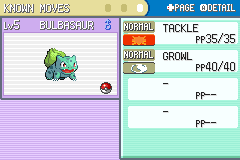
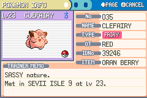
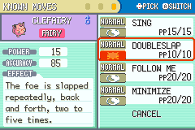

# Pokémon FireRed and LeafGreen - Updated

This is a version of Pokémon FireRed and LeafGreen based on the [**FireRed and LeafGreen disassembly**](https://github.com/pret/pokefirered) with added features, aiming to bring the additions and quality of life changes found in the newer games.

This project is intended for use by developers/ROM hackers to create their own games, and it not intended to be played by itself.

### Features (16% Complete): ###
- [X] Fairy Type 
- [X] Physical/Special Split
- [ ] Moves & Abilities Through Gen 8
- [ ] 905 Pokémon (Up to Gen 8)
- [ ] Items Through Gen 8
- [ ] Mega Evolutions
- [X] Decapitalization 
- [ ] Overworld Trainer Facing
- [ ] Reusable TMs
- [ ] Day/Night Cycle
- [ ] Seasons
- [ ] Roaming Pokémon

### Screenshots ###

### Comprehensive List of Changes ###
- The Fairy-type has been added as a new Pokémon type.
    - This type features the type icon in the summary menu.
    - Moves and Pokémon that were changed to be Fairy-type in newer games have been updated.
- The "Physical/Special Split" has been implemented.
    - Each move is defined as either physical, special, or status.
    - Places where the game previously checked the type, it now checks the move.
    - Icons for move categories have been added to the status menu.
- All previously unnecessarily capitalized text has been decapitalized. (Thanks to [**lioniac**](https://github.com/lioniac/frdecap)!)
- The default text speed has been changed to fast.

### Installation ###
For instructions on how to setup, install, and build the project, refer to the original [**INSTALLATION.MD**](https://github.com/pret/pokefirered/blob/master/INSTALL.md).

